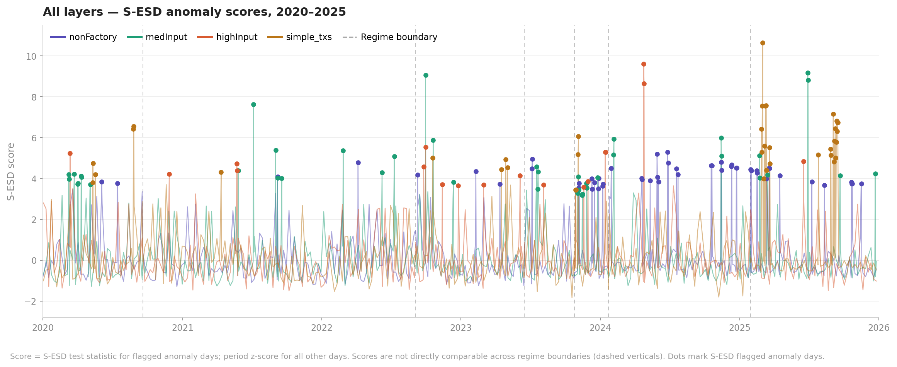
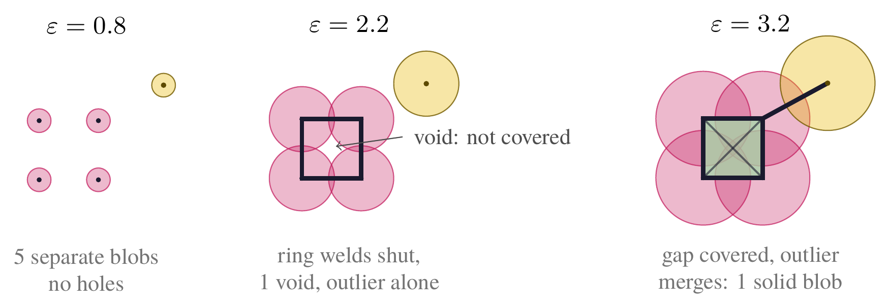
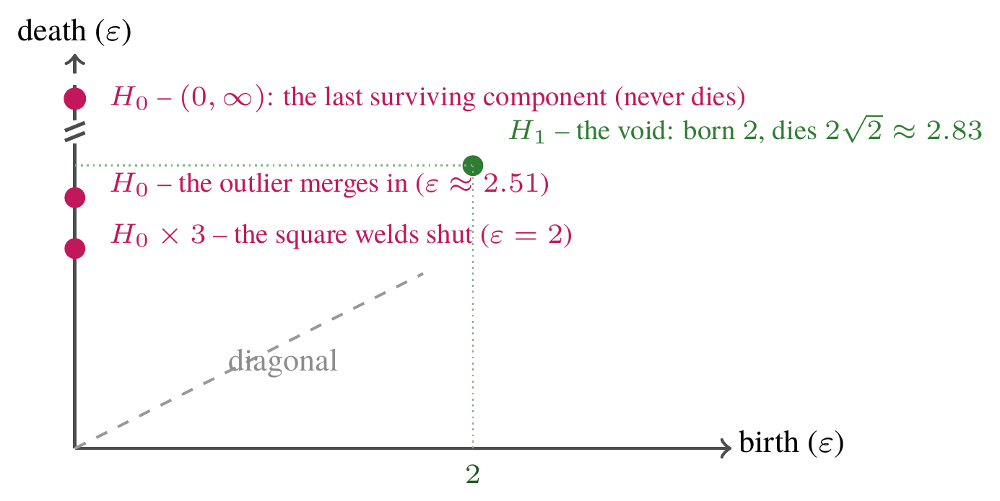
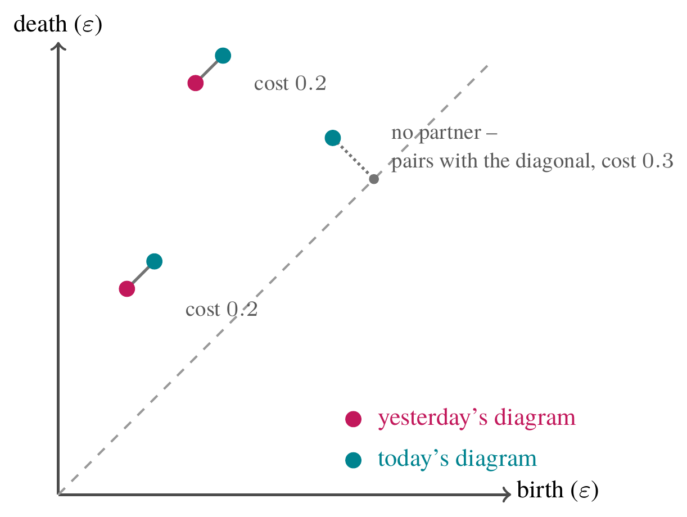
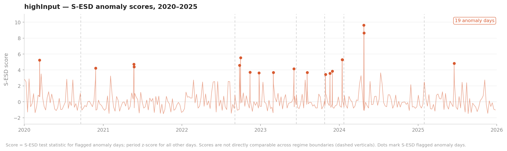
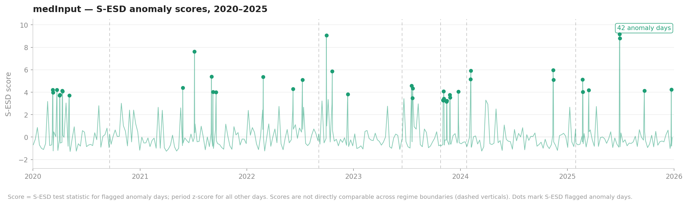
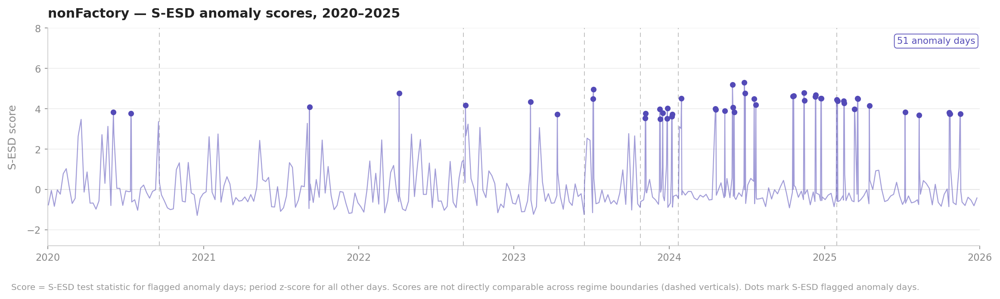
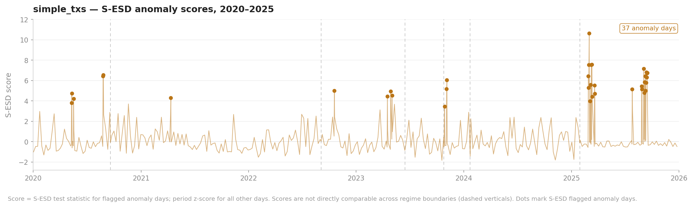

# The Shape of Ethereum: Six Years of Topological Anomalies

**Matan Prasma, Uri Yacobi Keller**

## Introduction

The purpose of this article is to report on a project that studies anomalies in Ethereum's transaction data, using a method called 'Topological Data Analysis' (TDA). The method is relatively new in data science and applies tools from Algebraic Topology, a field in mathematics that models interactions between geometric and algebraic structures.

More specifically, we take daily transaction data (including smart contract's execution) and divide it into four layers: zero-ETH transactions of small, medium and large calldata (reflecting smart contract execution), and non-zero ETH transactions. To each layer, we associate a sequence of increasingly bigger topological spaces (or: subsets of a high dimensional Euclidean space). In that sequence, connected components, loops enclosing an empty region etc. appear and disappear (or: born and die) and that data is organised into a 'persistence diagram'. By measuring differences in daily persistence diagrams, we are able to flag anomalous days, many of which correspond to real-world anomalous events, of either internal or external relation to the chain. Below is a graph of all four layers combined, for the period of 2020-2025, with anomalous days marked.

*All-layers S-ESD score overlay, 2020--2025.*

We analysed all Ethereum's transaction data in 2020-2025, and found 86 anomalies (more precisely, clusters of anomalous days). We then looked for real-world events that happened near those time points, that may explain the anomalous topology. Note that **we do not have a ground truth for meaningful, chain-altering real-world events. However, we do believe most events matched to the anomalies we found are plausibly chain-altering and invite the reader to go over them in detail (using the appendix [7]) and get a personal impression. Put differently, this project aims to showcase TDA, rather than point to a well-defined use-case.** Preliminary work also suggests this topological signal may be useful for near-term volatility prediction (see Future Work).

## Methodology

As is prevalent in mathematical tradition, it is often useful to associate a geometric object to a problem, and study the geometry in order to get insights on the original problem. Algebraic Topology enables us to study geometry by associating to it an algebraic object called 'Homology'. Roughly speaking, Homology counts the "holes" of a geometric object: separate pieces (connected components), loops that enclose an empty region, cavities enclosed on all sides, and so on, in any dimension.

Our data -- Ethereum addresses on a given day -- is not itself a geometric object: it is a cloud of points with a notion of distance between them (roughly, how closely they interacted, directly or through intermediaries), but no shape. Taking $D$ to be the diameter of our point cloud (the largest distance between any two points), we can let a scale parameter $\varepsilon$ range continuously from $0$ to $D$, and refer to the resulting sequence of shapes as a 'filtration' of our point cloud.

The method's first job is to manufacture this increasingly growing sequence of shapes from the cloud, one for every filtration scale. Using such a sequence of shapes, we can tell which topological features (connected components, loops enclosing an empty region, etc.) of the resulting shapes persist longer, hence are more likely to reflect real structure, and which persist only shortly, and are therefore likely to be artifacts of the scale at which they appear. The data of appearance/disappearance (or birth/death) of all topological features is organised in a 'persistence diagram', and we can measure similarity between two daily persistence diagrams using the 'Wasserstein distance'. The resulting time series is then input into a standard anomaly detection algorithm called S-ESD. Let us elaborate on each of the key building blocks described above.

### The Vietoris–Rips construction

Fix a scale ε. Around every point, draw a ball of radius ε/2; two points join as soon as their balls touch -- that is, as soon as they're within distance ε of each other. Now suppose three points are pairwise within range of one another, so every pair's balls touch -- even if the three balls don't all share one common point. We already have the three edges of a triangle connecting them; we now patch in the entire two-dimensional region enclosed by that triangle as well. If four points are pairwise within range, we similarly get a hollow tetrahedron's worth of edges and faces, and we fill in its enclosed cavity too. Continuing this in every dimension -- filling in the interior of any group of mutually within-range points, however large -- gives one geometric shape built entirely from the point cloud and the chosen scale ε.

Grow ε and the shape grows with it: balls that didn't touch start to overlap, separate points get joined, gaps fill in, hollows get patched. Nothing already connected is ever pulled apart, so this produces a nested sequence of shapes, one per value of ε, each containing the one before it.

Let $D$ be the diameter of the point cloud (the largest distance between any two points), as before. At ε = 0 there are no positive-dimensional holes yet -- just as many separate points as there are addresses. At ε = $D$, every pair of points is within range, so every possible group of points is mutually within range too: the whole cloud collapses into a single, fully filled-in shape, with no loops or voids left at all. So every loop and every void that ever appears is guaranteed to eventually get filled back in somewhere between 0 and $D$ -- it has both a birth and a death. Connected components are the one exception: many of them merge into each other as ε grows, but the very last one -- the network's own eventual, all-encompassing connectedness -- survives forever and never dies, which is exactly why it gets special treatment on a persistence diagram, as we'll see.

The figure below works through a small example by hand: five points, four of them arranged in a square, plus one point off to the side.

*Growing a disk of radius $\varepsilon/2$ around each of five points, with the simplicial complex overlaid in black/green.*

At a small scale (left), the balls don't reach each other at all -- five separate blobs, no structure. At a medium scale (middle), the four square-corner balls overlap along each side, welding the corners into a single ring -- but they're still too small to reach the middle, leaving a real, literal gap uncovered: a hole is *born*. The dark square traced on top is this loop made explicit: an edge is added wherever two balls touch, and here the four edges close into a ring enclosing nothing, sitting right on the visible gap. The fifth point is still on its own. At a larger scale (right), the balls finally reach across the diagonal to cover that gap -- the hole has *died* -- and the outlier's ball has also grown enough to join the ring. The overlay shows this too: the diagonals are now short enough to add as edges, and once every pair of square points is connected, the loop fills in as a solid patch (shaded green) -- the abstract complex and the geometric gap close at the very same instant, because they're two views of the same condition. As the scale grows, isolated points merge into groups, and loops of connected points can enclose a gap that later fills back in. In three (or more) dimensions the same construction can enclose a *void* -- an empty cavity sealed off on every side, born and dying by the same logic, just one dimension up.

### Persistent homology

Persistent homology is the record-keeping of this process, carried out across every scale at once and for every kind of hole homology can see -- pieces, loops, voids, and so on. For every feature that appears in the growing sequence of shapes, we record two numbers: the scale at which it was *born*, and the scale at which it *died*. A feature born early that survives across a wide range of scales is a robust, structural feature of the data, not a fluke of one threshold. A feature born and dead almost immediately is typically just noise: an accident of how the points happened to be sampled, not anything meaningful about their arrangement.

Applied to a day's Ethereum transaction data: build the nested sequence of shapes from that day's addresses, and track every connected group, loop, and enclosed void as it is born and dies across the full range of scales. The output is a whole list of birth/death pairs, not a single number -- one pair for every feature that ever appeared.

#### Why homology?

It's worth asking why "counting holes" is the natural thing to extract from a shape, rather than one reasonable-sounding choice among many. It is not arbitrary. Spaces are, in general, highly nonlinear objects -- gluing two of them together, for instance, does not behave anything like addition. Just as calculus approximates a nonlinear function by its derivative, a genuinely linear object, there is a homotopical-categorical framework -- $\infty$-categories, and in particular the associated theory of *stabilization* -- in which one can make precise sense of the best linear approximation to a space. Homology is exactly what that procedure sees: it is, in this sense, the linear approximation of a topological space. (The same idea can also be approached through Goodwillie calculus, which develops an analogous notion of linear approximation for functors between spaces.) We can't develop that properly here, but for the categorically-inclined reader, see, for example, [4, p.15] for the general framework in which this is made precise.

### Persistence diagrams

That list is easiest to work with as a picture: plot every feature as a point, birth on the horizontal axis, death on the vertical. Since a feature can only die after it's born, every point lands above the diagonal; the further above it a point sits, the longer that feature persisted, and the more likely it is to be real structure rather than noise. This scatter plot is the **persistence diagram**.

*Persistence diagram of the worked example.*

The diagram above records the small example from the previous figure: the three simultaneous mergers as the square's corners weld together, the later merger of the outlier, and -- well above the diagonal -- the single loop marking the birth and death of the central hole. The fifth point, the component left once everything has merged, never dies; rather than leave it off, it's plotted at $(0,\infty)$ on a broken axis above the rest, the standard way to keep an immortal feature on the same diagram as everything else. In the actual pipeline, one such diagram is produced per transaction layer, per day, and separately per homological degree -- one collecting the $H_0$ features (components), another the $H_1$ features (loops), since a component and a loop are never compared against one another. Together they compactly summarise that day's structure, at every scale at once.

### The Wasserstein distance between diagrams

To ask whether one day's transaction graph looked structurally different from the day before, we need a distance between two persistence diagrams, not just between points. The tool is the **Wasserstein distance**. Two diagrams are only ever compared if they hold the same kind of feature -- a given day's $H_0$ diagram against the previous day's $H_0$, $H_1$ against $H_1$ -- since a component and a loop have no sensible cost between them. Within one such comparison, the Wasserstein distance computes a **matching**: pair every point in one diagram with exactly one point in the other (or, lacking a good partner, with its own nearest point on the diagonal), so every point ends up paired with something, choosing whichever pairing minimises the total distance walked across all pairs. The minimisation is done separately per homological degree -- one optimal matching for the $H_0$ diagrams, another for the $H_1$ diagrams -- and a layer's overall daily distance is the sum of these: one number combining how much the components moved and how much the loops moved.

*A matching between two small persistence diagrams.*

### S-ESD: flagging anomalies in the resulting series

Everything so far turns a day's transaction data into a single number per layer: how much that day's topology differs from the day before. What's left is an entirely ordinary problem with nothing topological about it -- given a plain time series, which points are statistically anomalous? For this the pipeline uses **S-ESD** (Seasonal Extreme Studentized Deviate), a standard, off-the-shelf time-series anomaly detection method that would work identically on server response times or daily temperatures.

S-ESD builds on the Extreme Studentized Deviate test, a classical test for spotting multiple outliers in a batch of numbers: it repeatedly sets aside whichever remaining point deviates most from the rest, checks whether that deviation is statistically significant at a chosen level, and stops once nothing left is significant. "Seasonal" means the raw series is first decomposed into trend, seasonal, and residual components, with the outlier test run on the residual -- so a rhythm that's simply always higher on weekdays doesn't get mistaken for an anomaly.

## Pipeline Overview

*Our pipeline replicates and extends the methodology introduced by Ofori-Boateng et al. [1]. The key difference is how layers are handled: they compute the Wasserstein distance between the combined persistence diagram of all layers on each day; here, each layer gets its own daily persistence diagram and Wasserstein series, and the final anomaly set is the union of anomalies detected independently across the four series -- letting each layer surface its own structural disruptions rather than having weaker signals absorbed by louder ones.*

The code for this project is publicly available [5].

### Layers

Each day's transactions are split into four disjoint groups -- the four layers -- with a **separate daily graph constructed for each one** before computing persistence diagrams, producing four independent Wasserstein time series, one per layer, each tracking structural change within its own transaction population. The first three layers share a foundational property: they are **smart contract interactions with tx_value = 0** -- no ETH transferred directly, economic action happening inside the contract logic -- distinguished from each other by calldata size, a proxy for interaction complexity. The fourth layer is the complement: plain ETH value transfers. The transaction types listed below are illustrative estimates of what tends to populate each layer, going by typical calldata size and value alone -- not an exhaustive or definitive classification of every transaction inside it.

- **nonFactory** (tx_value = 0, calldata < 100 bytes): governance votes, ERC-20 transfers, simple oracle calls, staking deposits/withdrawals. Reacts to changes in *who participates* --- token distributions, ETF-driven custody flows, election results, regulatory shifts.

- **medInput** (tx_value = 0, 100--499 bytes): DeFi protocol calls --- lending, AMM swaps, liquidity provision. Reacts to DeFi-specific stress: exploits, credit crises, liquidity crunches, upgrade transitions.

- **highInput** (tx_value = 0, ≥500 bytes): factory deployments, complex protocol interactions, liquidation and keeper-bot logic. Reacts to anything triggering automated, programmatic responses at scale --- mass liquidations, emergency governance, exploit cleanup.

- **simple_txs** (tx_value > 0): plain ETH transfers with no contract logic. Reacts to raw capital movement --- retail activity at price extremes, exchange withdrawals, and (increasingly in 2025) ETF flow and macro-driven repositioning.

A crash, upgrade, or shock should leave its signature in whichever layer carries the mechanism of that event.

### Graph construction

**Nodes** are Ethereum addresses active that day -- both senders and receivers of transactions in that layer. **Edges** connect any two addresses that transacted with each other, weighted by transaction count for the day; a higher-weight edge means more repeated interaction between that pair.

**Sampling.** The full daily graph is too large to compute persistence diagrams over directly, so for each layer-day we take the **top 750 edges by weight**, collect every node incident to those edges, then retain *every* edge between those nodes -- not just the top 750. This gives a dense induced subgraph on the most-active address pairs, with no artificial sparsification of their mutual connections.

**Geodesic densification.** TDA requires a well-defined distance metric between every pair of nodes --- not just directly connected ones. Edge weights (transaction counts) are first converted to edge distances using a normalised similarity transform: for an edge with weight w, the edge distance is

d(u,v) = 1 / (1 + α · (w − w_min) / (w_max − w_min))

where w_min and w_max are the minimum and maximum edge weights in that day's subgraph, and α = 9 is a fixed scaling constant. This maps the highest-traffic edge to distance 1/(1+9) = 0.1 (very close) and the lowest-traffic edge to distance 1.0 (far). All-pairs shortest paths are then computed over these edge distances via Dijkstra: this redefines the distance between any two nodes as the minimal sum of edge distances along a path connecting them, so disconnected node pairs -- or node pairs with no direct edge at all -- are reached through intermediaries rather than left undefined. Any pair with no path at all is assigned 2 × max_finite_distance as a sentinel. The resulting distance matrix is finally normalised to [0, 1] by dividing by its maximum, producing a metric suitable for the Vietoris--Rips filtration.

Raw Ethereum transaction data is aggregated to daily resolution and split into four disjoint layers before the above pipeline runs. The resulting four-layer Wasserstein signal is then passed through **change-point detection** and per-layer **S-ESD** anomaly detection, described in Change Points below.

## Case Studies

Three events, selected for tight same-day or next-day detection with clear layer-mechanism fit. Three more case studies (2021, 2023, 2024), plus the full event-matching and attribution methodology, attribution tiers, and complete list of all 86 anomaly events with their real-world correspondents, are in the companion appendix [7].

### 2020 --- Black Thursday (March 12)

On March 12, 2020, COVID panic selling combined with cascading on-chain liquidations caused ETH to crash 43% in 24 hours. Mempool congestion let a single actor win MakerDAO collateral auctions with zero-bid transactions, draining roughly $8.3M in DAI while the system's price oracles lagged [2]. The highInput layer registers the largest single-day Wasserstein spike in the 2020 record, **same day**, at the **100th percentile** (z = 5.2).

Black Thursday wasn't primarily a price event --- it was a mechanism failure: keeper bots racing to liquidate undercollateralised vaults, oracle contracts updating under load, emergency governance calls. These are precisely the heavy, multi-step, programmatic interactions that define highInput. A pure price crash with no on-chain liquidation cascade would not register here; the fact that it does, this strongly, is the signature of a *mechanism* breaking.

A separate medInput anomaly on March 8--9 captures the initial COVID macro shock (equities circuit-broke March 9, oil crashed 25%) --- a distinct event that precedes Black Thursday by three days within the same crisis window.

### 2022 --- Russia Invades Ukraine (February 26)

Russia launched its full-scale invasion of Ukraine on February 24, 2022, triggering an immediate global risk-off shock. The medInput layer fires **two days later** (z = 5.1, **100th percentile**).

February 24 was a Saturday; on-chain DeFi activity peaks on weekdays. By February 26 the scale of the invasion was clear, and the DeFi response --- stablecoin flows into safe assets, lending protocol collateral adjustments, liquidity withdrawals --- was playing out in mid-complexity contract calls. This is exactly what medInput measures: deliberate protocol-level repositioning, not automated liquidation cascades (highInput). At z = 5.1 and the 100th percentile of its period, this is one of the cleanest macro-to-on-chain signatures in the dataset.

### 2025 --- Bybit Hack (February 21)

On February 21, 2025, attackers compromised Bybit's Ethereum cold wallet and drained 401,000 ETH ($1.46B at the time) --- the largest single theft in crypto history. The medInput layer fires the **next day** (z = 5.1, **99.9th percentile**).

The one-day lag is the detection working correctly, not a miss. The theft itself happened in a single transaction --- invisible to the Wasserstein distance, which measures *structural* change in the interaction graph, not value moved. What the detector catches is what happened afterward: stolen funds began routing through DeFi bridges, DEX aggregators, and mixing protocols, generating a wave of mid-complexity contract calls that restructured the medInput graph. This is exactly the layer that should fire: not highInput (which would respond to automated liquidation cascades) and not nonFactory (which tracks governance and custody flows), but the DeFi-routing layer where illicit fund dispersal operates.

The medInput score of 5.1 is one of the ten highest in the six-year record. For context: the Bybit hack moved more ETH in one day than Celsius, 3AC, and FTX combined. The on-chain response was proportionate.

## Change Points

Change-point detection asks a different question than the anomaly detector in Methodology. Rather than flagging individual days that stand out against their immediate surroundings, it looks for a small number of moments where the *overall statistical character* of the signal shifts -- its typical level, volatility, or trend -- carving the six-year record into a handful of internally consistent regimes. This matters directly for anomaly detection: a Wasserstein spike unremarkable in a naturally turbulent regime could be extreme in a quiet one, which is why S-ESD runs separately within each regime rather than against one global baseline for the whole six years.

Concretely, the four layers' Wasserstein series are treated as one multivariate signal -- four numbers per day -- and handed to `ruptures`, a standard *offline* change-point detection method. "Offline" means the algorithm sees the entire six-year record at once and optimises globally, rather than processing the series day by day. It searches for the breakpoints that minimise total within-segment variance across all four series simultaneously (an "L2 cost"), finding whichever partition makes each resulting segment as internally homogeneous as possible. Allowed six to nine breakpoints, it settles on six, dividing the 2,191-day record into seven periods, each with its own characteristic mean, variance, and trend:

| Change point | Nearest known catalyst |
|---|---|
| 2020-09-19 | End of DeFi Summer |
| 2022-09-04 | Eleven days before The Merge |
| 2023-06-16 | One day after BlackRock's spot BTC ETF filing |
| 2023-10-25 | Start of the BTC ETF anticipation rally |
| 2024-01-23 | Post-approval volatility settles (BTC ETF, Jan 10) |
| 2025-01-29 | The DeepSeek AI shock |

**2020-09-19.** The yield-farming phase of DeFi Summer peaked in mid-September 2020; from this point the network entered a cooling phase before the 2021 bull cycle.

**2022-09-04.** Eleven days before The Merge. The algorithm detects a regime shift as validators, MEV searchers, and protocol operators began repositioning well ahead of the headline date.

**2023-06-16.** One day after BlackRock filed for a spot Bitcoin ETF --- a filing widely interpreted as signalling genuine approval was possible for the first time, triggering a broad market re-rating.

**2023-10-25.** The start of the BTC ETF anticipation rally, as BTC surpassed $35k and ETH broke $2,000 for the first time since May 2022.

**2024-01-23.** Post-approval volatility settles. The US spot Bitcoin ETFs were approved January 10, 2024; initial trading was dominated by Grayscale GBTC outflows. By January 23 net flows had stabilised and a new institutional-adoption regime began.

**2025-01-29.** The DeepSeek AI shock (January 27, 2025). Nvidia fell 17% in a single session and a broad risk-off move across tech and crypto marked the start of a more volatile regime in the Wasserstein signal.

The algorithm finds these breaks with zero knowledge of price or news --- purely from the shape of the four Wasserstein series --- and every one lands within two weeks of an identifiable catalyst. The change points partition the six years into regimes: DeFi-native (2020--22), Merge transition (2022), ETF-anticipation (2023), institutional-adoption (2024), macro-integrated (2025).

Within each of these shared regimes, S-ESD is then run independently on each of the four layers' own series, flagging that layer's anomalous days relative to the regime's local baseline rather than a single global one. The 86 anomaly clusters discussed throughout this piece are the union of all four layers' independently flagged days: a day counts as anomalous if *any* single layer flags it, not only if several agree.

## What the Layers Tell Us

The four layers are not arbitrary partitions --- they track genuinely different populations, and their differing sensitivities are a finding in their own right.

highInput is the **crash layer**: Black Thursday, the May 2021 crash, FTX, Bybit. Complex liquidation mechanics and factory-deployed contracts dominate these days.

*[Chart: highInput S-ESD scores, 2020--2025. Coral line with coral dots marking 19 flagged anomaly days.]*

medInput is the **DeFi operations layer**: lending crises (Celsius, 3AC), exploits, upgrade transitions (Shanghai, Dencun). This is where protocol-level stress shows up first, and where precursors tend to appear --- the Celsius and Curve signals both arrived in medInput days before the public event.

*[Chart: medInput S-ESD scores, 2020--2025. Green line with green dots marking 42 flagged anomaly days.]*

nonFactory is the **governance and institutional layer**, and its behaviour changes the most across the six years. Nearly silent in 2020--21, it becomes the dominant anomaly source in 2024 as ETF flows, election results, and tariff policy all register here. Its evolution from dormant to dominant is itself a record of Ethereum's transition from a DeFi-native to an institutionally integrated network.

*[Chart: nonFactory S-ESD scores, 2020--2025. Purple line with purple dots marking 51 flagged anomaly days.]*

simple_txs is the **retail and macro layer**: All-Time High moments, halvings, and --- increasingly in 2025 --- ETF-driven flows and Fed policy reactions.

*[Chart: simple_txs S-ESD scores, 2020--2025. Amber line with amber dots marking 37 flagged anomaly days.]*

The clearest summary: in 2024, nonFactory fires 11 of 16 events and simple_txs fires only 1. In 2025 that nearly inverts --- simple_txs becomes the most active layer while highInput goes quiet. Something about who is transacting, and how, changed between those two years, and the layer rotation is visible without looking at a single price chart.

## Future Work

**Volatility prediction.** The same pipeline extends naturally beyond anomaly-flagging. In a companion experiment [6], rolling statistics of the per-layer TDA descriptors -- alongside standard financial features -- were tested as predictors of near-term ETH volatility. A modest but statistically robust signal emerged for 7-day-ahead elevated-volatility classification (AUC improved from 0.480 to 0.523, holding up across seeds, surviving FDR correction, and retaining part of its effect under a placebo-shuffle test), though it did not generalise to a 3-day horizon, and a volatility-targeting strategy built on the signal beat a financial-only baseline without beating plain buy-and-hold. We see this as suggestive rather than a ready trading signal, but it points at a natural direction for anyone interested in applying this pipeline to markets -- potentially including cryptocurrency trading -- rather than anomaly detection alone.

**Chain health / stress metric.** If topological distance reliably flags structural stress in real time, a rolling version could function as an early-warning indicator for protocols, exchanges, or governance bodies. The precursor cases (COMP, Celsius, Curve) suggest the signal sometimes moves before public information does.

**Cross-chain comparison.** The same pipeline applied to Solana, Bitcoin, or an L2 would let us ask whether macro integration is Ethereum-specific or a property of any sufficiently large, sufficiently financialised chain. It would also let us compare how quickly different chains' topology absorbs a shock --- a possible proxy for resilience.

**Governance applications.** The layer-rotation finding is, in effect, a measurement of *who* is using Ethereum and how that's shifting. A live version could give governance bodies evidence-based foresight about which participant population a proposed change would actually affect.

**More topological constructions.** The choices made here --- Vietoris--Rips filtration, transaction count as edge weight, geodesic densification, $H_0$ and $H_1$ homology --- are one point in a large space of possible topological pipelines. Edge weights could be built from transaction value, gas used, or MEV extracted. Filtrations other than VR (Čech, alpha complexes, directed flag complexes that respect the from→to direction of transfers) would capture different structural features. Higher homological degrees ($H_2$ voids) may carry signal that $H_1$ alone misses. Each construction choice asks a subtly different question of the data, and it is not obvious that the choices made here are the most informative ones for every event type.

## References

1. Ofori-Boateng et al., "Topological Anomaly Detection in Dynamic Multilayer Blockchain Networks," arXiv:2106.01806 (2021)
2. Glassnode Research, "What Really Happened to MakerDAO" (2020)
3. Bloomberg/CoinDesk reporting on ETH spot ETF first-day trading volume, July 24, 2024
4. Harpaz, Y., Nuiten, J. and Prasma, M., "The abstract cotangent complex and Quillen cohomology of enriched categories," Journal of Topology, 11(3), 2018, pp. 752--798 (see p. 15)
5. Simplex-TDA, "ETH-Anomaly-Detection" (code repository), <https://github.com/Simplex-TDA/ETH-Anomaly-Detection>
6. Simplex-TDA, "predictive-validation" (volatility-prediction experiment), <https://github.com/Simplex-TDA/ETH-Anomaly-Detection/tree/main/predictive-validation>
7. Simplex-TDA, "Appendix" (event-matching and attribution methodology, attribution tiers, and the complete list of all 86 anomaly events) -- link to be added
