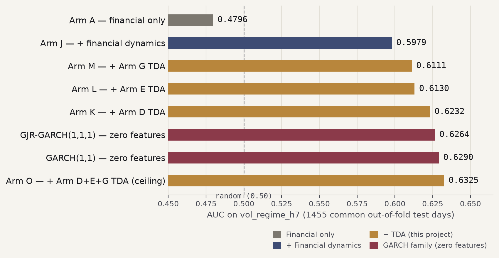

# Predictive Validation: Does This Repo's Topology Also Predict Volatility?

**Short answer: yes, with real statistical evidence — for volatility *prediction*, not (yet) for trading *profitability*.**

<p align="center"></p>

## The headline finding

Topological features extracted from Ethereum's daily on-chain transaction graph — the same persistence-diagram construction this repository already uses for anomaly detection ([Ofori-Boateng et al., 2021](https://arxiv.org/abs/2106.01806)) — give a machine learning model **statistically significant, placebo-confirmed predictive power** for forecasting whether the next 7 days will be more volatile than usual. This holds up on top of plain financial indicators, on top of a much stronger baseline of aggressively engineered financial dynamics, and even on top of a combined baseline that already includes **GARCH**, the textbook volatility-forecasting model used throughout quantitative finance.

This is a genuinely different question from what this repository's own notebooks ask. `1_dataFetcher.ipynb` → `3_tda.ipynb` build the topology to spot turbulence **after** it's already visible in the graph (anomaly detection, retrospective). This excerpt asks whether the same topology, hooked up to a predictive model instead, also carries information about **future** volatility, ahead of time.

**This is a predictive-power finding, not a trading-profitability claim.** Whether it translates into a profitable trading strategy is a separate, harder question investigated independently in the fuller project this excerpt is drawn from — out of scope for what's here.

**→ [Read the full report](REPORT.md)** for the complete methodology, every finding, the honest limitations, and exactly how this connects to this repository's own topology pipeline.

## The 4 notebooks

Each loads already-computed results (small parquet/CSV files, bundled in `data/`) rather than re-running any walk-forward validation — they execute in seconds, not hours, and are meant to be read top to bottom.

| # | Notebook | What it shows |
|---|---|---|
| 1 | [`01_phase1_regime_association.ipynb`](notebooks/01_phase1_regime_association.ipynb) | Are independently-discovered financial and topological regimes related? Includes the mutual-information analysis and a real hyperparameter-selection bias this project caught and corrected for — the honest holdout result is null. |
| 2 | [`02_predictive_framework_and_baseline.ipynb`](notebooks/02_predictive_framework_and_baseline.ipynb) | The walk-forward prediction framework, the `vol_regime_h7` target, and why the original 140 static TDA descriptors don't help (six remediation attempts, all null). |
| 3 | [`03_tda_dynamics_confirmed_findings.ipynb`](notebooks/03_tda_dynamics_confirmed_findings.ipynb) | The reframing that worked — temporal dynamics of TDA descriptors instead of static snapshots. Four independent, placebo-confirmed feature families. |
| 4 | [`04_beyond_financial_engineering_and_garch.ipynb`](notebooks/04_beyond_financial_engineering_and_garch.ipynb) | Does TDA survive much harder baselines — engineered financial dynamics, and GARCH (the industry-standard volatility model)? |

## Why this might be worth your time

Most "TDA + finance" work stops at a proof-of-concept correlation. This project instead ran ~10 full confirmatory rounds — purged walk-forward validation, paired bootstrap + FDR-corrected significance testing, placebo controls that quantify what fraction of an improvement is genuine signal vs. just extra model capacity, two-seed robustness checks, and independent re-derivation of every headline number from saved data rather than trusting a notebook's printed output. Two real methodology bugs were caught and fixed during the project, and are documented (in the fuller project's own log) rather than hidden. Null results got exactly the same rigor as positive ones.

## Quick results summary

| Question | Answer | Evidence |
|---|---|---|
| Are independently-discovered financial and topological *regimes* related? | **Yes, same-day** — but tested twice, honestly | DBSCAN's first pass looked exciting but didn't survive a holdout (a real hyperparameter-selection bias, caught and corrected). Redone with a time-aware Hidden Markov Model, the same-day relationship is real and *does* survive the holdout (p = 0.001) — though there's no lead-lag: neither system predicts the other's *future* regime. |
| Does TDA beat plain financial features? | **Yes** | 4 independent feature families confirmed, +0.05 to +0.09 AUC, 80-95% placebo-genuine |
| Does TDA survive a much stronger baseline (engineered financial dynamics)? | **Yes** | 3 of 4 families still significant, combined ceiling +0.035 AUC (p < 0.001) |
| Does TDA survive the hardest baseline (GARCH + financial dynamics)? | **Yes** | +0.045 AUC beyond GARCH+dynamics (p < 0.001), highest AUC in the project (0.653) |
| Does the full stack beat plain GARCH outright? | **Not yet, conventionally** | +0.024 AUC, p ≈ 0.06–0.08 — a near-miss, pushed twice, unmoved |

## Running these yourself

```bash
cd predictive-validation
python3 -m venv .venv && source .venv/bin/activate
pip install pandas numpy matplotlib scikit-learn pyarrow jupyter
cd notebooks
jupyter nbconvert --to notebook --execute --inplace 01_phase1_regime_association.ipynb
# ...repeat for 02-04, or open in Jupyter and run interactively
```

No raw blockchain data and no persistence-diagram computation happen in
this folder — the notebooks only read the small result files already
bundled in `data/`.

## Where the underlying data comes from

This report's numbers ultimately trace back to **this repository's own
topology pipeline** (`1_dataFetcher.ipynb` → `2_ranking.ipynb` →
`3_tda.ipynb`, producing `run_results_V1_{YEAR}.json`) — but not
directly: a separate, downstream feature-engineering and walk-forward ML
pipeline (not included in this folder, part of a larger private research
project) consumes those files and produces the small comparison tables
this folder's notebooks load. See ["Where the underlying data actually
comes from"](REPORT.md#where-the-underlying-data-actually-comes-from-and-what-regenerating-it-from-scratch-requires)
in the full report for the precise two-stage breakdown and what you'd
need to regenerate everything from raw data.

## Repository layout (this folder)

- **[`README.md`](README.md)** — this file.
- **[`REPORT.md`](REPORT.md)** — the full findings report. Start here for the narrative.
- **[`notebooks/`](notebooks/)** — the 4 notebooks above.
- **`data/`** — small, bundled result files the notebooks load.
- **`figures/`** — every chart referenced in `REPORT.md`.

## Scope and license

This is a research case study on a single asset (ETH) over a single ~4-year historical window — not investment advice, and not a claim that generalizes to other assets or blockchains without re-validation. See [REPORT.md's limitations section](REPORT.md#what-this-does-not-show) before drawing broader conclusions.
