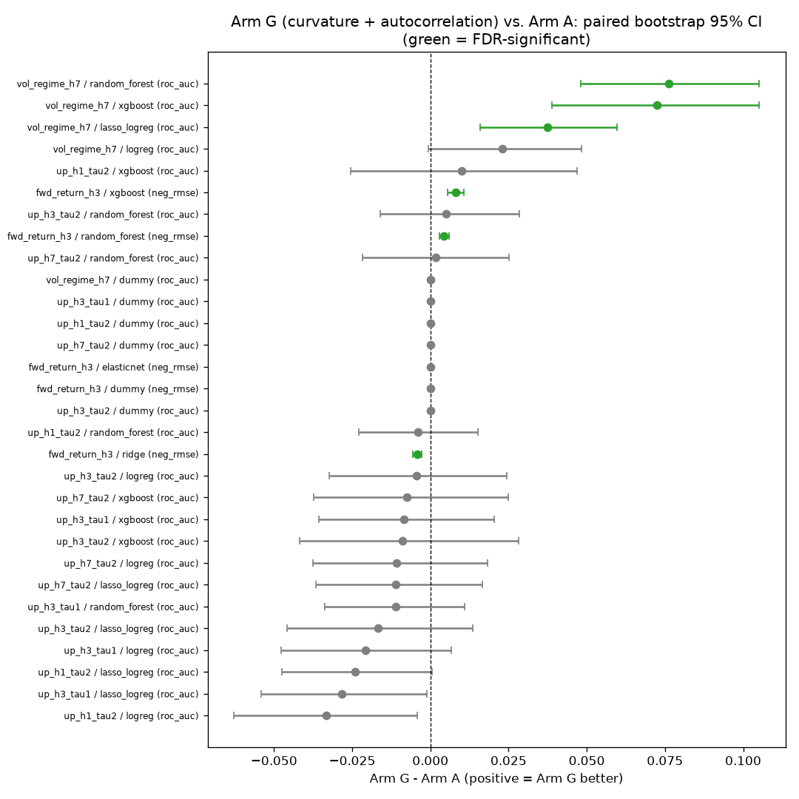
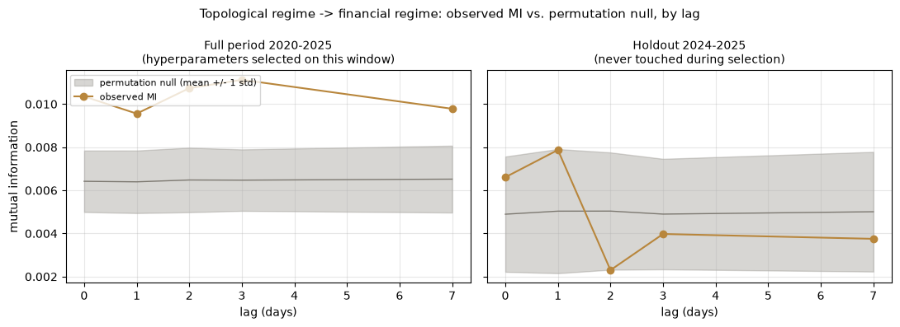
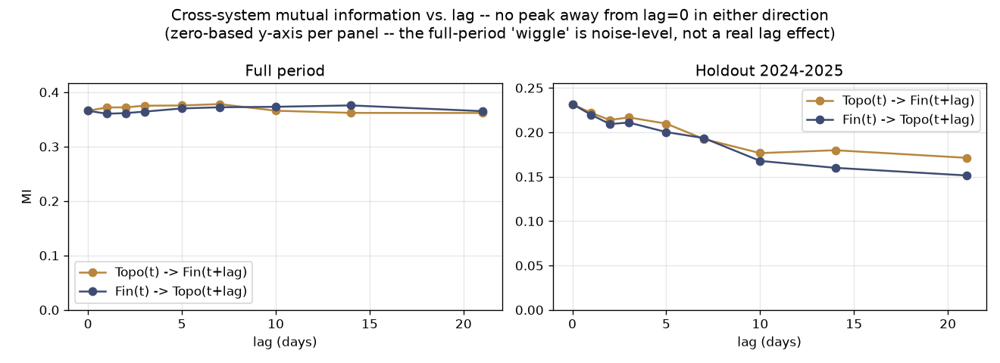
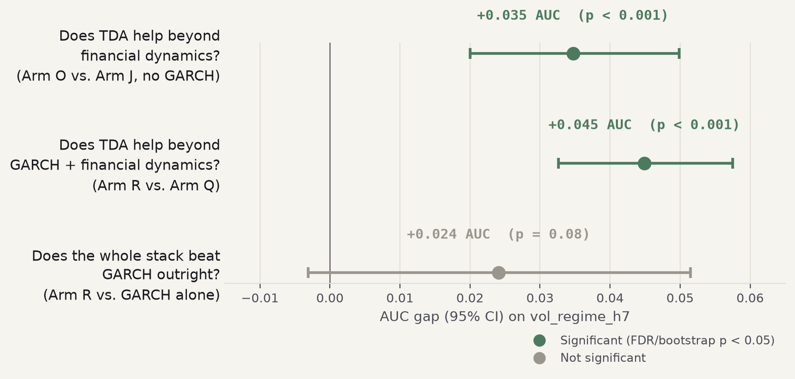

# Does Topological Data Analysis Improve Crypto Volatility Prediction?

**A case study on Ethereum: topological features of the on-chain transaction graph, tested against sophisticated financial feature engineering and a domain-standard volatility model (GARCH).**

> **About this folder.** This is a self-contained excerpt — report, figures, and the 4 notebooks that reproduce every number below from already-computed results — drawn from a larger private research project. Where this report mentions that project's own internal log (referred to below by name, without a working link, since it isn't part of this excerpt), that's provenance, not a broken cross-reference: it's there so a specific claim can be traced back to its full derivation if needed, not because this folder depends on it. See ["Reproducing this work"](#reproducing-this-work) below for exactly what is and isn't included, and how this connects to this repository's own topology pipeline.

---

## TL;DR

**Yes — with real, repeated statistical evidence, and a specific, honest scope.**

Topological Data Analysis (TDA) applied to Ethereum's daily on-chain transaction graph produces features that give a machine learning model **statistically significant, placebo-confirmed predictive power for forecasting volatility regimes** — whether the next 7 days will be more turbulent than usual. This holds up:

- against a plain financial-features baseline (the original, most basic test),
- against a *much* stronger baseline of aggressively engineered financial dynamics (rolling/exponentially-weighted transforms of standard indicators),
- and even against a combined baseline that already includes both financial dynamics **and** GARCH — the actual textbook volatility-forecasting model used in quantitative finance.

**This report is deliberately, narrowly scoped to that one question — does this topology carry incremental predictive information about future volatility.** It does not address whether that translates into trading profitability, which this project investigated separately as a distinct, harder question (see this project's research log) — out of scope for what follows.

---

## Table of contents

1. [Why this is a hard, credible test](#why-this-is-a-hard-credible-test)
2. [What TDA features actually are here](#what-tda-features-actually-are-here)
3. [Methodology: how every claim below was checked](#methodology-how-every-claim-below-was-checked)
4. [The starting question — are financial and topological *regimes* related?](#finding-0) (two passes: DBSCAN, then HMM)
5. [Finding 1 — TDA adds real signal beyond plain financial features](#finding-1)
6. [Finding 2 — It survives a much harder baseline: sophisticated financial dynamics](#finding-2)
7. [Finding 3 — It survives the hardest baseline: GARCH](#finding-3)
8. [What this project does *not* show](#what-this-does-not-show)
9. [Reproducing this work](#reproducing-this-work)
10. [Project structure](#project-structure)

---

## Why this is a hard, credible test

Most "TDA + finance" writing is a proof-of-concept: a novel feature is shown to correlate with something, and that's the whole story. This project tried hard *not* to stop there, because the easy way to get an exciting-looking result in this domain is a look-ahead bug, a hyperparameter chosen after peeking at performance, or an untested claim that doesn't survive a placebo control. Two real mistakes were made and caught during this project (documented in full in this project's research log, not hidden) — a hyperparameter-selection bias in an early phase, and a numerical-stability bug that briefly contaminated one exploratory pass. Both were caught by the same discipline described below, before either reached a claimed result.

Every finding in this report survived:

- **Purged, embargoed walk-forward validation** — no training fold ever sees information from its own test window, with a margin wide enough that a feature's forward-looking construction can't leak across the boundary.
- **Paired bootstrap significance testing**, with Benjamini–Hochberg false-discovery-rate correction applied across every comparison tested together (not cherry-picked one at a time).
- **A placebo control**: the candidate feature columns' row order is shuffled, breaking their real temporal alignment while preserving each column's own distribution, and the whole comparison is rerun. If an apparent improvement survives shuffling, it isn't really using time-aligned information — it's just extra model capacity. Every finding below reports what fraction of its improvement is *genuine* (survives shuffling) versus *capacity* (doesn't).
- **Two-seed robustness** — every result is checked at a second random seed before being trusted.
- **Independent re-derivation** — every headline number in this report was recomputed directly from saved prediction files in a fresh script, not just read off a notebook's own printed output.

---

## What TDA features actually are here

The underlying data is a set of daily **persistence diagrams** — the core output of topological data analysis — computed over four different views ("layers") of the Ethereum transaction graph: simple transfers, and contract calls split by whether they touch a factory contract and by how much input data they carry. Each layer, each day, produces a snapshot of the graph's connectivity (H0, the 0-dimensional homology) and cyclic structure (H1, the 1-dimensional homology) at that moment — things like how fragmented the network is that day, how much "looping" structure exists in the flow of transactions, and how those properties compare to recent history.

This topology construction follows the anomaly-detection methodology of Ofori-Boateng et al., ["Topological Anomaly Detection in Dynamic Multilayer Blockchain Networks"](https://arxiv.org/abs/2106.01806) (2021) — persistent homology over a rolling window of a (multilayer) transaction graph, validated on Ethereum, used to flag structural breaks in network shape. In this project's broader pipeline, the same construction has already been used to detect known stress events (e.g. "Black Thursday," March 2020) after the fact, retrospectively, not ahead of time. This report asks a distinct, deliberately narrow, and purely qualitative question that construction was never designed to answer: **does the same topology, built for spotting turbulence once it's visible in the graph, also carry incremental information about *future* volatility, when handed to a predictive model?** The findings below are the answer for volatility specifically — real and statistically significant (Findings 1–2), and a near-miss against the strongest baseline tested (Finding 3). This report does not claim the method was designed for prediction, or extend the claim beyond volatility to price direction or magnitude, which this project separately found no confirmed skill for.

The central methodological finding of the whole project, arrived at only after six null results on the raw static descriptors, is that **the object of interest isn't a single day's persistence diagram — it's the *trajectory* of persistence diagrams through time.** Static, single-day snapshots of the diagram's shape consistently failed, no matter how the shape was sliced (raw descriptors, PCA, persistence-image regions, Euler characteristics, cross-layer agreement). What consistently worked was **temporal dynamics** of a descriptor: how it's been trending, how volatile it's been, how it's been accelerating, how directly it's been moving through its own state space — rolling statistics, exponentially-weighted trends, autocorrelation, path length and straightness of the trajectory, and local coherence of recent motion.

<p align="center"></p>

*One of four independently confirmed TDA feature families (curvature + autocorrelation of the topological trajectory) tested against a plain financial baseline. Green = statistically significant after false-discovery-rate correction. The volatility-regime target (top row) is positive across three different model types simultaneously.*

---

## Methodology: how every claim below was checked

Every comparison follows the same protocol:

1. **State the hypothesis and pre-commit before looking at performance.** A stability screen (does a candidate feature rank in the top 40 by importance at two different random seeds?) picks the candidate shortlist *before* any confirmatory performance number is looked at.
2. **Confirmatory pipeline**: the pre-committed shortlist is added to a baseline feature set, and both are run through the exact same 6-target × 5-model grid (RandomForest, XGBoost, plain and L1-regularized logistic/linear regression, and a dummy baseline), walk-forward validated, paired-bootstrap tested, FDR-corrected.
3. **Placebo control** on the standout result — genuine signal vs. model capacity, quantified.
4. **Two-seed robustness check.**
5. **Independent re-derivation** of every headline number from the saved prediction files.
6. **Report honestly, whatever the result** — this project has as many confirmed *null* findings as positive ones (documented in full in this project's research log), reported with the same rigor.

The target throughout is **`vol_regime_h7`**: will Ethereum's realized volatility over the next 7 days exceed its own trailing 90-day level? This is a **binary classification of a volatility regime**, not a price-direction or return-magnitude prediction — every attempt in this project to predict price direction either failed outright or was actively *hurt* by the same features that help volatility prediction. That's a real, load-bearing scope limitation, stated plainly rather than left implicit.

---

## The starting question — are financial and topological *regimes* related?<a name="finding-0"></a>

Before any of the predictive-value testing above, this project's first approach was more direct: cluster the market into **financial regimes** and separately cluster the blockchain into **topological regimes**. If the two independently-discovered regime labelings line up on the same days, that's evidence the blockchain graph carries market-relevant structure. This question was tested twice, with two different clustering methods, and the second pass reverses the first pass's conclusion — both attempts are reported here rather than only the final one.

### First pass: DBSCAN — a real result, then a real bias caught in it

The first attempt used DBSCAN (9 PCA components of 26 normalized financial indicators → 2 real regimes, a dominant "normal" state and a rare 10-day extreme state; 5 PCA components of 140 detrended persistence-diagram descriptors → 21 regimes, one dominant, the rest small). The full-period result looked genuinely exciting: same-day mutual information between the two regime labels was significant at every lag tested (0, 1, 2, 3, 7 days; permutation test, p = 0.005–0.034). **But an audit — not an assumption — found a real problem**: the topological clustering's hyperparameters (PCA dimensionality, DBSCAN's `eps` and `min_samples`) had themselves been selected by grid-searching 151 configurations for whichever one maximized same-day MI against the financial regimes, computed on the 2020–2023 window. That's circular — a hyperparameter search *optimized for* agreement with financial regimes will, unsurprisingly, show agreement with financial regimes.

The honest test: rerun the same comparison on the untouched **2024–2025 holdout**, which played no role in selecting anything. Observed MI drops (0.0104 → 0.0066) and **no lag reaches significance** (p = 0.15–0.94):

<p align="center"></p>

DBSCAN also raised a separate, more basic concern: it found only 2 real financial regimes and 1 dominant topological one, with everything else either a tiny cluster or "noise." DBSCAN has no notion of *time* — it treats every day as an independent point in feature space — so a market/topology process with gradually-shifting regimes tends to collapse into one big density blob plus scattered noise, rather than the structure a persistence-aware model should find.

### Second pass: Hidden Markov Models — the more standard tool for this job, and the null does not hold up

Regime-switching HMMs (Hamilton, 1989) are the domain-standard alternative precisely because they model **persistence** explicitly, via a transition matrix, instead of clustering days as if they were independent. Redone with a `GaussianHMM` per system, same feature sets and preprocessing as the DBSCAN pass, with the number of hidden states chosen by BIC — computed only on each system's own 2020-2023 training data, never by reference to the other system — preserving the same non-circular design the DBSCAN audit above established.

**Both of the original suspicions turned out to be correct:**

- **DBSCAN's "2 regimes" was real under-detection.** BIC selects K=11 states for financial, K=9 for topological — every state genuinely persistent (mean day-to-day self-transition probability 0.836 financial / 0.883 topological, vs. ~0.09–0.11 if regimes were random) and recurring many times over the sample, not one-off blocks.
- **The same-day relationship is real and survives an honest holdout.** Full period: MI = 0.366 (permutation p = 0.001). Untouched 2024–2025 holdout: MI = 0.232 (p = 0.001) — this time the holdout *confirms* rather than erases the full-period result. Normalized MI sits at 0.14–0.17: clearly non-zero, far from redundant. Robust to a fully independent refit-seed set, and not an artifact of one big coincidental overlap (the regime-pair contingency table is meaningfully differentiated, not dominated by a single row).

<p align="center"></p>

**One new question, tested and answered cleanly negative: no lead-lag structure.** Regime(t) in one system was tested against regime(t+lag) in the other, both directions, lags of 0 through 21 days, full period and holdout. No lag ever beats lag=0 in either direction — the relationship is same-day, not a forward-looking signal at the regime-label level. This doesn't contradict the predictive-value findings below, which work with continuous engineered features at a day-by-day forecasting horizon — a different, finer-grained claim than discrete regime-label lead-lag.

**The honest conclusion: two independently-discovered regime labelings agree same-day, at a level that survives an honest holdout and several robustness checks — once the clustering method actually models time.** The original DBSCAN null was itself real (the specific circular hyperparameter-selection bias it caught was genuine and worth fixing), but it was also a symptom of a cruder clustering method under-detecting structure that a time-aware model finds. This is exactly the kind of result this project tries to report evenhandedly: neither pass is hidden, and the correction is shown, not just the final number.

**A natural next question — does the regime association itself add predictive value, not just describe a relationship? Tested directly, and mostly answered no.** Adding these HMM regime labels as extra features on top of this project's strongest confirmed arm moved the needle on this project's actual target (`vol_regime_h7`) only slightly, seed-consistently negative-to-null across every model — every Phase 2 arm already carries its own (simpler) regime-dummy signal, and this result says that signal's marginal value is largely exhausted. A real, placebo-confirmed positive effect does exist, but only for linear models on directional targets — a part of this project's results space already flagged as unreliable elsewhere in this report. See this project's research log ("Do the HMM regime labels add predictive value in Phase 2?") for the full breakdown.

*(See `notebooks/01_phase1_regime_association.ipynb`, included in this folder, for the full walkthrough of both passes. The complete HMM analysis and the regime-labels-as-features follow-up are part of the fuller research project this excerpt is drawn from, not included here.)*

---

## Finding 1 — TDA adds real signal beyond plain financial features<a name="finding-1"></a>

Four independent TDA feature families were built, tested, and confirmed against a baseline of 26 standard financial indicators (returns, volatility, momentum, volume, trend):

| TDA feature family | AUC gain (RandomForest) | Placebo-genuine residual |
|---|---|---|
| Scalar dynamics (rolling/EWM stats of core topological descriptors) | **+0.093** | 95% |
| Trajectory-of-diagrams descriptors (path length, straightness, coherence) | +0.051 | 80% |
| Curvature + autocorrelation of the topological trajectory | +0.076 | 89% |
| Exhaustive dynamic sweep of every remaining static descriptor | +0.086 | 93% |

(AUC starts from a baseline around 0.48 — i.e., these gains move a near-random classifier to genuinely informative territory. "Placebo-genuine residual" is the percentage of the improvement that survives the shuffle-placebo control described above — the fraction that's real temporal signal, not just extra model capacity.)

A fifth, more exhaustive descriptor family was tested and came back a **confirmed null** — a useful negative result, not a gap in the search: static, single-day shape descriptors (persistence-image regions, Euler characteristic curves, cross-layer agreement on a single day) never produced a confirmed effect, reinforcing that *temporal dynamics*, not any particular mathematical descriptor family, is the load-bearing idea.

---

## Finding 2 — It survives a much harder baseline: sophisticated financial dynamics<a name="finding-2"></a>

A natural objection: maybe *any* sufficiently rich, dynamically-engineered feature set would show a similar gain, and TDA isn't special. This was tested directly and rigorously, not waved away.

Applying the *exact same* dynamic-transform toolkit (rolling stats, EWM, autocorrelation) to the financial features' own base fields — zero topology, zero blockchain data — produced **the single largest individual-arm effect found anywhere in this project**: +0.118 AUC over the plain financial baseline. This is a real, useful, humbling finding on its own: financial dynamics captures a lot of what the earlier TDA-vs-plain-financial comparisons were showing.

The harder, better question is then: **does TDA still add anything on top of this much stronger baseline?** Three of the four confirmed TDA families were re-tested against it:

<p align="center"></p>

*Every approach tested, ranked by predictive AUC on the same out-of-fold test days. Financial dynamics alone (indigo) is a large jump over plain financial features (grey) — but TDA (gold) reliably adds further ground on top of it.*

Three of four TDA shortlists **still added a statistically significant, placebo-confirmed improvement** on top of financial dynamics (the fourth did not — itself informative, discussed in this project's research log). Combining the three confirmed-useful families reached this project's TDA-only ceiling: **RandomForest AUC 0.6325**, beating financial dynamics alone by +0.035 (p < 0.001).

---

## Finding 3 — It survives the hardest baseline: GARCH<a name="finding-3"></a>

Every result so far was tested against baselines built *inside* this project. Neither is the actual professional standard for volatility forecasting — that's the **GARCH** model family: a handful of parameters, fit directly on returns, capturing volatility clustering with zero engineered features and zero TDA. This project ran that comparison directly, using a plain, untuned GARCH(1,1) walk-forward validated the same way as everything else, with no lookahead (verified directly: perturbing a return and rerunning the identical construction leaves every earlier date's forecast unchanged).

**GARCH alone scored AUC 0.629** — tying this project's entire TDA-augmented ceiling from Finding 2 (p = 0.78, not significantly different). This was the project's most important calibration moment: a three-parameter model with zero feature engineering matched months of feature-engineering work. It's not a retraction of Finding 2 — every comparison there remains valid on its own terms — but it changes what "TDA adds value" should be read to mean in practice.

The right follow-up isn't comparing GARCH against the project's features as an outside competitor — it's giving GARCH's own forecast to the model **as an input feature**, then asking the same question again from that harder starting point:

<p align="center"></p>

Two things came out of this, and they answer genuinely different questions:

- **TDA still adds significant value even on top of GARCH *and* financial dynamics combined** — the hardest bar tested anywhere in this project. +0.045 AUC, p < 0.001, both RandomForest and XGBoost significant, 69% of the improvement placebo-confirmed as genuine. This reached **RandomForest AUC 0.6531 — the highest point estimate in the entire project.**
- **Does the complete stack (GARCH + financial dynamics + TDA) beat plain GARCH outright?** Closer than anything else tried (+0.024 AUC, p ≈ 0.06–0.08, stable under 20,000-resample re-estimation) — but not conventionally significant. Two different ways of pushing this closer (more statistical precision; a mechanism-motivated model change, precedented from an earlier round of this same project) were tried and both left it essentially where it started.
- One genuine caution surfaced along the way: naively adding GARCH's forecast as one feature among a small financial feature set actually made the model score *worse* than GARCH alone (0.589 vs. 0.629) — a real, useful lesson that "just add the model's forecast as a feature" isn't automatically a free improvement; it needs enough complementary context to avoid being diluted.

**The honest summary of Findings 1–3**: TDA adds real, repeatedly confirmed predictive information, on top of every baseline this project could construct, including the actual industry-standard one. Whether the resulting full pipeline is worth building *instead of* GARCH alone — as opposed to *alongside* it — remains a genuinely open, near-miss question.

---

## What this project does *not* show<a name="what-this-does-not-show"></a>

Said plainly, because a research writeup that only lists wins isn't trustworthy:

- **Not addressed here: trading profitability.** This report is intentionally scoped to whether the topology carries predictive information about future volatility — it does not claim, and does not attempt to show, that this translates into a profitable trading strategy. That is a separate, harder question this project investigated independently; see this project's research log for that work.
- **Not proven: the full pipeline beats plain GARCH.** The closest result in the project (p ≈ 0.06–0.08) is a near-miss, not a win, even after two different attempts to sharpen it.
- **Scope is volatility, not price.** Nothing here predicts price direction or magnitude with any confirmed skill; several TDA/financial-dynamics additions actively *hurt* directional prediction while helping volatility prediction, a consistent pattern across many tests.
- **Single asset, one blockchain, ~4 years of data.** This is an Ethereum case study, not a general claim about crypto assets or blockchains. ~4 years of daily data may lack the statistical power to resolve smaller effects regardless of method (established directly by testing this, not assumed).
- **No live/real-time TDA computation.** The topological features here are computed from a precomputed historical batch of on-chain graph data, not a live feed — this project is a historical research validation, not a deployed live system.

### Potential future directions, not yet attempted

On the "more descriptors from the existing persistence diagrams" axis, this project has been exhaustively mined — static descriptors, rolling/EWM dynamics, trajectory path-length/straightness/coherence, curvature and autocorrelation, persistence-image regions, Euler characteristic, cross-layer agreement, with several confirmed nulls along the way (Finding 1). Two genuinely different techniques exist but weren't attempted, both requiring the raw diagram-computation pipeline to be rebuilt from the blockchain graphs — a much bigger undertaking than anything above:

- **Zigzag persistence** — the formal generalization of this project's own central finding (temporal dynamics matter more than daily snapshots): tracks topological features continuously across time-varying graphs directly, rather than computing independent daily diagrams and stitching rolling-stat dynamics on top afterward.
- **Graph (Ollivier-Ricci) curvature**, computed directly on the transaction graph rather than on the persistence trajectory — a genuinely different signal from persistent homology, with real precedent in finance (used elsewhere for network-stress/fragility detection).

---

## Reproducing this work

This folder is self-contained and lightweight — the 4 notebooks load
already-computed result files (`data/`, a few MB of parquet/CSV) rather
than re-running any walk-forward validation, so they execute in seconds:

```bash
cd predictive-validation
python3 -m venv .venv && source .venv/bin/activate
pip install pandas numpy matplotlib scikit-learn pyarrow jupyter
cd notebooks
jupyter nbconvert --to notebook --execute --inplace 01_phase1_regime_association.ipynb
# ...repeat for 02-04, or open in Jupyter and run interactively
```

No raw blockchain data, and no persistence-diagram computation, happens
in this folder at all.

### Where the underlying data actually comes from, and what regenerating it from scratch requires

This report's numbers come from a **two-stage pipeline**, and only the
small output of the *second* stage is bundled here:

1. **This repository's own topology engine** (`1_dataFetcher.ipynb` →
   `2_ranking.ipynb` → `3_tda.ipynb`, at the root of this repo) — takes
   raw Ethereum/ERC20 transaction data and produces
   `run_results_V1_{YEAR}.json`: daily persistence diagrams (H0/H1) and
   Wasserstein distances, per layer, per year. This is the same anomaly-
   detection pipeline this repository already uses for its own core
   purpose; nothing about it changes for this report.
2. **A separate, downstream feature-engineering and walk-forward ML
   pipeline** — **not included in this folder**, part of the larger
   private research project this excerpt is drawn from — consumes those
   `run_results_V1_*.json` files, derives ~140 topological descriptors
   per layer (rolling statistics, EWM trends, autocorrelation, curvature,
   trajectory features — see "What TDA features actually are here"
   above), joins them against financial indicators and a GARCH baseline,
   and runs the purged walk-forward + paired-bootstrap + FDR + placebo
   confirmatory testing described throughout this report. Its output —
   small comparison tables and out-of-fold predictions, not raw diagrams
   — is what's bundled in this folder's `data/`.

This folder never touches stage 1's output directly; it only reads
stage 2's small result files, which is why it's fast and self-contained.
**To regenerate everything from scratch**: stage 1 is already in this
repository (its own root-level notebooks); stage 2 is a separate
codebase not (yet) part of this repository — get in touch if you need
access to it rather than assuming it's reproducible from what's here.

---

## Project structure

```
predictive-validation/
├── README.md          # Start here — headline finding, quick-results table, notebook index
├── REPORT.md           # This file — the full narrative report
├── data/                # Small, bundled result files the notebooks load (not raw diagrams)
│   └── processed/
│       ├── financial_regimes/ · tda_regimes/ · merged/   # Phase 1 regime-association results
│       └── backtest_results/                              # Model comparisons, OOF predictions
├── figures/              # Every chart referenced in this report
└── notebooks/            # The 4 notebooks — run in seconds, reproduce every number above
    ├── 01_phase1_regime_association.ipynb
    ├── 02_predictive_framework_and_baseline.ipynb
    ├── 03_tda_dynamics_confirmed_findings.ipynb
    └── 04_beyond_financial_engineering_and_garch.ipynb
```

This is an excerpt, not the whole research project — see "Where the
underlying data actually comes from" above for what sits upstream of it
and isn't included here.

The complete, warts-and-all research history behind this excerpt — every one of the ~10 confirmatory rounds this project ran, including the null results, the two methodology bugs that were caught and fixed, and the reasoning behind every design decision — lives in that fuller project's own research log, not included in this folder.
